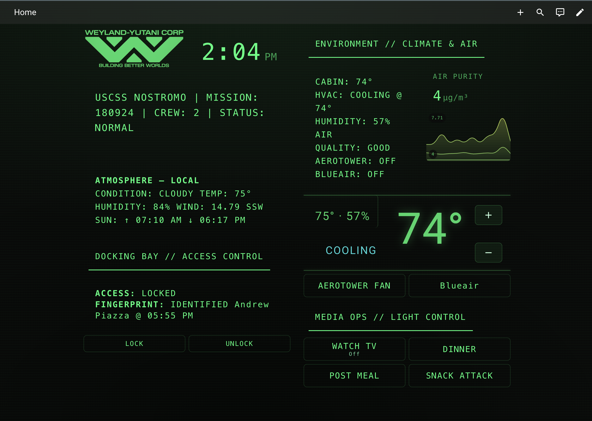

# Weyland-Yutani CRT Theme for Home Assistant


> *"Building Better Worlds."*  
> A retro-futuristic Home Assistant theme emulating the interface of the **USCSS Nostromo**.  
> Designed for fans of the *Alien* universe — monochrome phosphor glow, subtle scanlines, and Weyland-Yutani terminal typography.

---

## Overview

The Weyland CRT Theme recreates the 1970s computer aesthetic of the Nostromo’s on-board computer, MU/TH/UR, while retaining full modern Home Assistant readability and performance.  
It’s ideal for dashboards on wall-mounted tablets or dark ambient setups.

---

## Installation

1. Copy `nostromo_crt.yaml` into your `/config/themes/` folder.  
2. Add this to your `configuration.yaml` file (if you haven’t already):

   ```yaml
   frontend:
     themes: !include_dir_merge_named themes
   ```

3. Restart Home Assistant.  
4. Go to your **Profile → Theme** and select **Nostromo CRT**.

---

## Preview



---

## Weyland-Yutani Logo

The Weyland-Yutani Corp logo used in the preview is included in this repository (`Weylandv2.png`).

To use it in your own dashboard:

1. Download [`Weylandv2.png`](Weylandv2.png).  
2. Copy it to your Home Assistant `/config/www/` folder.  
3. Reference it in your Lovelace dashboard as `/local/Weylandv2.png`.

### Example usage
```yaml
type: picture
image: /local/Weylandv2.png
tap_action:
  action: none
card_mod:
  style: |
    ha-card {
      --g: var(--nostromo-green, #00ff7a);
      background: transparent;
      border: none;
      box-shadow: none;
      display: flex;
      justify-content: center;
      align-items: center;
      padding: 0;
      filter: drop-shadow(0 0 10px rgba(0,255,122,0.35));
    }
```

This will render the Weyland-Yutani logo at the top of your dashboard with a subtle CRT phosphor glow effect, matching the *Weyland CRT* aesthetic.

---

## Additional Resources

For advanced users looking to extend or modify the interface, additional `card-mod` and layout snippets are available:

- [Lovelace Style Examples](Lovelace_Style_Examples.md)

These examples demonstrate optional enhancements such as transparent cards, glowing borders, and custom text layouts that complement the *Weyland CRT* design language.

---

## Credits

Inspired by the design language of the *Alien* franchise and the industrial systems aesthetic of Weyland-Yutani Corporation.  
Created and maintained by **Andrew504s**.
